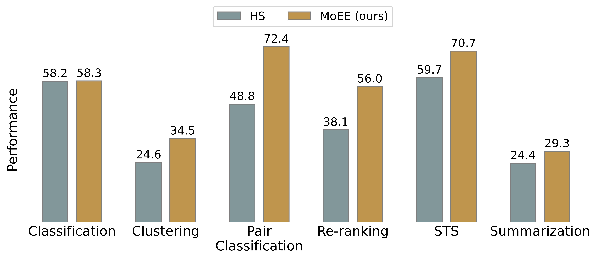

# MoE Embedding: Your Mixture-of-Experts LLM Is Secretly an Embedding Model For Free

## Abstract
While large language models (LLMs) excel on generation tasks, their decoder-only architecture often limits their potential as embedding models if no further representation finetuning is applied. Does this contradict their claim of generalists? To answer the question, we take a closer look at Mixture-of-Experts (MoE) LLMs. Our study shows that the expert routers in MoE LLMs can serve as an off-the-shelf embedding model with promising performance on a diverse class of embedding-focused tasks, without requiring any finetuning. Moreover, our extensive analysis shows that the MoE routing weights (RW) is complementary to the hidden state (HS) of LLMs, a widely-used embedding. Compared to HS, we find that RW is more robust to the choice of prompts and focuses on high-level semantics. Motivated by the analysis, we propose MoEE, combining RW and HS, which achieves better performance than using either separately. Our exploration of their combination and prompting strategy sheds several novel insights, e.g., a weighted sum of RW and HS similarities outperforms the similarity on their concatenation. Our experiments are conducted on 6 embedding tasks with 20 datasets from the Massive Text Embedding Benchmark (MTEB). The results demonstrate the significant improvement brought by MoEE to LLM-based embedding without further finetuning. 




## Requirements

To run this code, you will need the following packages:

- `transformers`: Provides the necessary models and tokenizers for our experiments.
- `torch`: For running the models efficiently on your GPU or CPU.
- `bitsandbytes`: To support 4-bit quantization and reduce memory usage.

You can install all the dependencies with the following command:

```bash
pip install transformers torch bitsandbytes
```

## Usage

This code evaluates Mixture-of-Experts (MoE) models as embedding models on tasks from the Massive Text Embedding Benchmark (MTEB). You can specify the model, task type, and embedding method via command-line arguments.

### Command for Evaluation

To run the evaluation, use the following command:

```bash
python eval_mteb.py \
    --base_model $base_model \
    --use_4bit \ 
    --task_types $task_types \ 
    --batch_size 128 \  
    --emb_info $emb_info \ 
    --embed_method 'none'
```

### Argument Breakdown

- **`--base_model`**:  
    - Specify the base model to use for embedding extraction. Available options are:  
        - `"deepseek-ai/deepseek-moe-16b-base"`
        - `"Qwen/Qwen1.5-MoE-A2.7B"`
        - `"allenai/OLMoE-1B-7B-0924"`
  
- **`--use_4bit`**:  
    - Enables 4-bit quantization for model inference. This significantly reduces memory usage while maintaining good model performance, which is useful for running models on lower-end hardware or fitting larger models on smaller GPUs.

- **`--task_types`**:  
    - Defines the type of tasks you want to run the evaluation on. Supported task types are:  
        - `'STS'`
        - `'Classification'`
        - `'Clustering'`
        - `'PairClassification'`
        - `'Reranking'`
        - `'Summarization'`

- **`--batch_size`**:  
    - Specifies the batch size to use during inference.

- **`--emb_info`**:  
    - Specifies the type of embeddings to evaluate. You have the following options:  
        - `'HS'`: Use the hidden state (HS) of the model as the embedding. This is the default strategy used in many pre-trained models.
        - `'RW'`: Use the routing weights (RW) from the Mixture of Experts (MoE) model as the embedding. RW is often more robust to prompt variations and captures high-level semantic information.
        - `'MoEE'`: Use a combination of hidden state (HS) and routing weights (RW) to create a more comprehensive embedding. This option can be particularly useful when you want to leverage the strengths of both types of embeddings.
        - If you want to run the 'MoEE (sum)' method, use `similarity_ensemble` as input and set `similarity_weights` to adjust the combination of HS and RW.

- **`--embed_method`**:  
    - Determines the prompting strategy to use when generating embeddings. Available options include:  
        - `'none'`: No specific prompting is applied. The embeddings are extracted directly from the model without any additional text input modifications.
        - `'prompteol'`: Use a prompt strategy where an end-of-line token or phrase is added to influence the model's generation of embeddings. This can help capture certain high-level features.
        - `'customized prompts'`: You can define your own prompts to tailor the embedding generation. This provides more flexibility for specific tasks where certain prompts can better guide the model's focus.

## Citation

Please consider citing our paper if you think our codes, data, or models are useful. Thank you! <br>

```
@inproceedings{li-zhou-2024-moee,
    title = "Your Mixture-of-Experts LLM Is Secretly an Embedding Model For Free",
    author = "Li, Ziyue and Zhou, Tianyi",
    booktitle = "arXiv:2410.10814",
    year = "2024",
}
```
